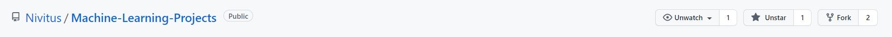
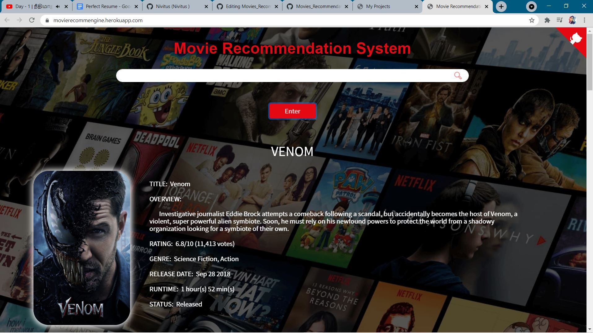
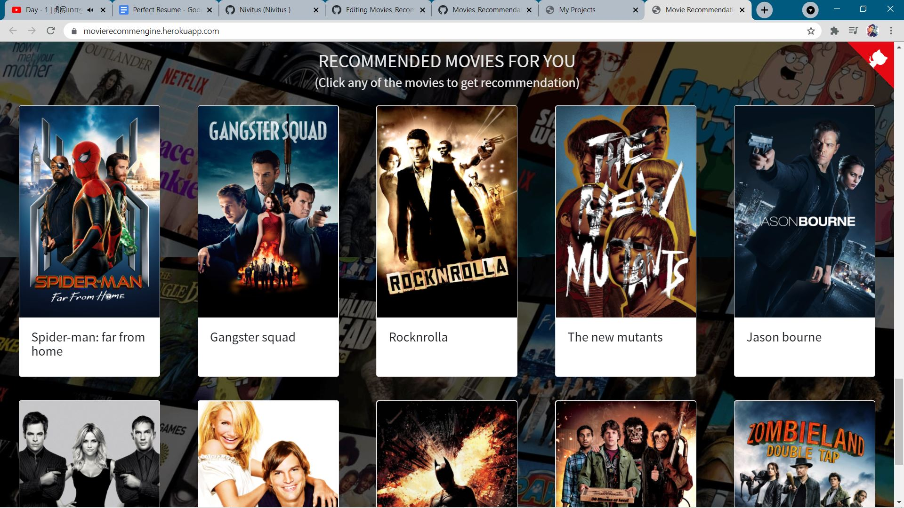
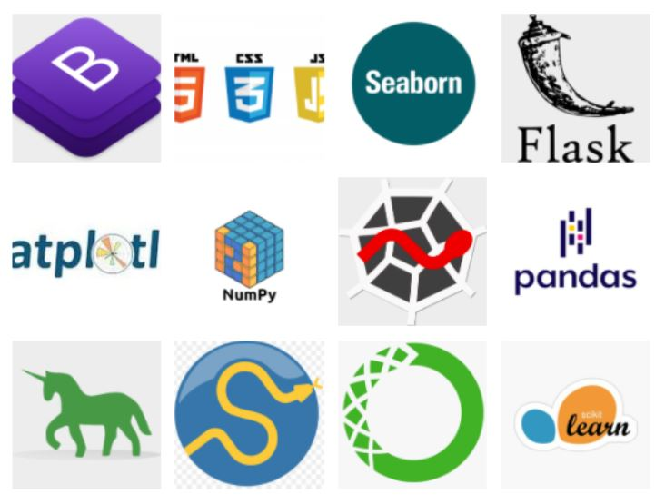

# Movies_Recommendation_Engine

   

## Table of Content ##
- [Demo](#demo)
- [Overview](#overview)
- [Motivation](#motivation)
- [Technical Aspects](#technical-aspects)
- [Installation](#installation)
- [Run](#run)
- [About Dataset](#about-dataset)
- [Deployment on Heroku](#deployment-on-heroku)
- [To Do](#to-do)
- [Bug / Feature Request](#bug-feature-request)
- [Technologies Used](#technologies-used)
- [Team](#team)
- [License](#license)
- [Credits](#credits)

## Demo

  

## Overview

Recommendation systems are becoming increasingly important in today’s extremely busy world. People are always short on time with the myriad tasks they need to accomplish in the limited 24 hours. Therefore, the recommendation systems are important as they help them make the right choices, without having to expend their cognitive resources.

Nowadays, the number of people using Netflix, Hotstar Movies has increased significantly.The purpose of a recommendation system basically is to search for content that would be interesting to an individual. Moreover, it involves a number of factors to create personalised lists of useful and interesting content specific to each user/individual. Recommendation systems are Artificial Intelligence based algorithms that skim through all possible options and create a customized list of items that are interesting and relevant to an individual. These results are based on their profile, search/browsing history, what other people with similar traits/demographics are watching, and how likely are you to watch those movies.

## Motivation

Ever wondered how Netflix or Hotstar recommends new movies based on the watch history, I really want to know about how Amazon or Flipkart suggests new products based on your order or search history? These suggestions or recommendations are done by a system called a recommendation system. This engine makes suggestions by learning and understanding the patterns in your watch history (let’s say) and then applies those patterns and findings to make new suggestions.


## Technical Aspects
Since we can deploy atmost 5 app in Heroku as a free service, I came up with a new idea of deploying all my projects in a single web app and controlling the each projects navigation with Flask and Python.

Some extra-ordinary features that I have included in my app :
- Visualizing Probability of classifcation in each classification type problems.
- Added all the details about the projects such as data source, code source, libraries and frameworks used in each project's description.
- All my end to end projects in a single view.
- I have to convert into Mobile Application for easy use for formers.

## Installation
To run my app on your local machine, do the following steps.
> **Step 1** : 
   - I have written the Code with Python 3.7.7. If you don't have Python installed you can find it [here](https://www.python.org/downloads/release/python-377/).
   - If you are using a lower version of Python you can upgrade using the pip package, kindly ensure that you have the latest version of pip.
> **Step 2** :
   - If you want the current version of my repository to be in your github, you can do forking my repository by clicking as shown in the picture below.
   
   [](https://github.com/Nivitus/Machine-Learning-Projects)

   
   - Clone my repository to your local machine by running the following command. Before doing this, you have to install git on your machine and make sure you are having proper internet connection.
      - For **Windows OS** user, open *git bash* and run the following command.
      ```bash
      git clone https://github.com/Nivitus/Machine-Learning-Projects.git
      ```
      
      - For **Linus OS** user, open *Terminal* and run the following command.
      ```bash
      git clone https://github.com/Nivitus/Machine-Learning-Projects.git
      ```
   
   - If you don't want to mess up with all these things, you can just download the *zip* file of my GitHub repository by clicking [here](https://github.com/Nivitus/Machine-Learning-Projects/archive/master.zip) and extract it to any file location as your wish and then use it.
   - Now we have done with the downloading of my whole project.

> **Step 3** :
   - After downloading the whole repo, get into the main folder by hit the following command in git bash for Windows OS users and Terminal for Linux OS users.
   ```bash
   cd Deep-Learning-Projects
   ```

> **Step 4** :
   - Now we are going to install all the dependency libraries for this project. Before that you must have Python 3.7.7 and latest version of pip.
   - To install all the dependency libraries in a single command, run the following command.
   
   ```bash
   pip install -r requirements.txt
   ```
   
> **Step 5** :
   - After installing all the dependency libraries, you are ready to run my app on your local machine.
   - To launch my app on your local machine, hit the following command.
   ```bash
   python ml_projects.py
   ```

## Run
- Now you have successfully launched my app on your local machine.
- To view my app, hit the following URL in any of the browser such as Chrome, FireFox, etc..,
   
   ```bash
   http://127.0.0.1:5000/
   ```

## About Dataset
For this project I have download dataset form [Kaggel](https://www.kaggle.com/rounakbanik/movie-recommender-systems/data). In this dataset there are three folders like train , test and validation folder . In this dataset features like Departure time, Arrival Time, Source, Destination, Stopage and Airline Service Names.

## Deployment on Heroku
- After successfully running my app on your local machine, you can also deploy my app on heroku by following the steps given on [Heroku Documentation](https://devcenter.heroku.com/articles/getting-started-with-python). You have to do it on your own risk.
- In case, if you have any issues on deploying the app, please open a new issue by clicking [here](https://github.com/Nivitus/Machine-Learning-Projects/issues/new/choose). Because it may help others while deploying.
- Here is the Deployment link [click here](https://movierecommengine.herokuapp.com/)

  
  

## To Do

These features will be added in the future :
1. Using Exception handling for handling invalid input.
2. Adding a link to the data source in the project description popup modal.
3. Adding GitHub link to each projects in both description popup modal and project page.
4. Adding better visualization charts for classification type problems.
5. Adding visualization for regrerssion type problems.

## Bug / Feature Request

If you find a bug (the website couldn't handle the query and / or gave undesired results), kindly open an issue [here](https://github.com/Nivitus/Machine-Learning-Projects/issues/new) by including your search query and the expected result.

If you'd like to request a new function, feel free to do so by opening an issue [here](https://github.com/Nivitus/Machine-Learning-Projects/issues/new/choose). Please include sample queries and their corresponding results.

## Technologies Used

  

## How to get the API key?

Create an account in https://www.themoviedb.org/, click on the `API` link from the left hand sidebar in your account settings and fill all the details to apply for API key. If you are asked for the website URL, just give "NA" if you don't have one. You will see the API key in your `API` sidebar once your request is approved.

## How to run the project?

1. Clone or download this repository to your local machine.
2. Install all the libraries mentioned in the [requirements.txt](https://github.com/kishan0725/Movie-Recommendation-System-with-Sentiment-Analysis/blob/master/requirements.txt) file with the command `pip install -r requirements.txt`
3. Get your API key from https://www.themoviedb.org/. (Refer the above section on how to get the API key)
3. Replace YOUR_API_KEY in **both** the places (line no. 15 and 29) of `static/recommend.js` file and hit save.
4. Open your terminal/command prompt from your project directory and run the file `main.py` by executing the command `python main.py`.
5. Go to your browser and type `http://127.0.0.1:5000/` in the address bar.
6. Hurray! That's it.

## Architecture


## Similarity Score : 

   How does it decide which item is most similar to the item user likes? Here we use the similarity scores.
   
   It is a numerical value ranges between zero to one which helps to determine how much two items are similar to each other on a scale of zero to one. This similarity score is obtained measuring the similarity between the text details of both of the items. So, similarity score is the measure of similarity between given text details of two items. This can be done by cosine-similarity.
   
## How Cosine Similarity works?
  Cosine similarity is a metric used to measure how similar the documents are irrespective of their size. Mathematically, it measures the cosine of the angle between two vectors projected in a multi-dimensional space. The cosine similarity is advantageous because even if the two similar documents are far apart by the Euclidean distance (due to the size of the document), chances are they may still be oriented closer together. The smaller the angle, higher the cosine similarity.
  
  

  
More about Cosine Similarity : [Understanding the Math behind Cosine Similarity](https://www.machinelearningplus.com/nlp/cosine-similarity/)

#

### Sources of the datasets 

1. [IMDB 5000 Movie Dataset](https://www.kaggle.com/carolzhangdc/imdb-5000-movie-dataset)
2. [The Movies Dataset](https://www.kaggle.com/rounakbanik/the-movies-dataset)
3. [List of movies in 2018](https://en.wikipedia.org/wiki/List_of_American_films_of_2018)
4. [List of movies in 2019](https://en.wikipedia.org/wiki/List_of_American_films_of_2019)
5. [List of movies in 2020](https://en.wikipedia.org/wiki/List_of_American_films_of_2020)


## Team
[](https://nivitus.herokuapp.com/) |
-|
[NIVITUS](https://nivitus.herokuapp.com) |)


## License
   Copyright 2020 Nivitus

   Licensed under the Apache License, Version 2.0 (the "License");
   you may not use this file except in compliance with the License. 
   You may obtain a copy of the License at

       http://www.apache.org/licenses/LICENSE-2.0

   Unless required by applicable law or agreed to in writing, software
   distributed under the License is distributed on an "AS IS" BASIS,
   WITHOUT WARRANTIES OR CONDITIONS OF ANY KIND, either express or implied.
   See the License for the specific language governing permissions and
   limitations under the License.

## Credits
1. Kaggle - I have collected dataset from kaggle for some of the projects such as Loan Status Prediction, Iris Species Classification, Boston House Price Prediction, etc..,
2. Krish Naik -  I have Learned many of the concepts & ideas from his Youtube Channel.


 

